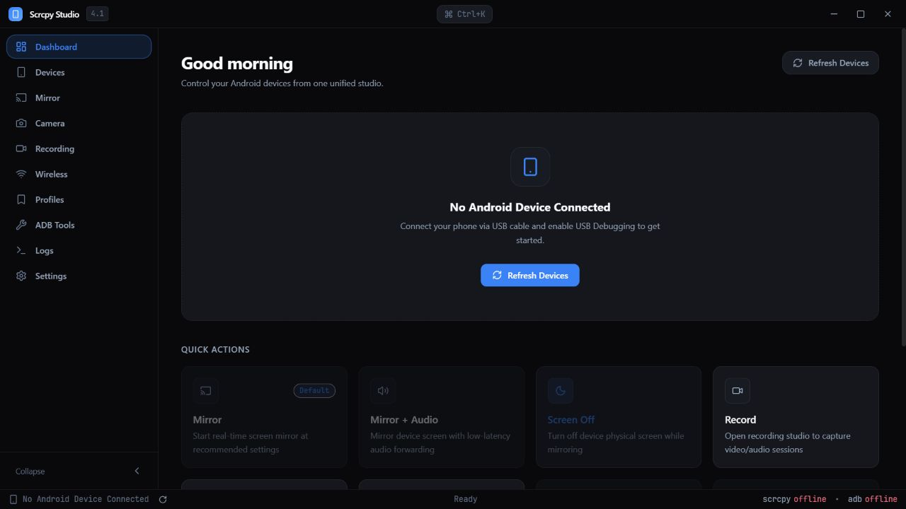
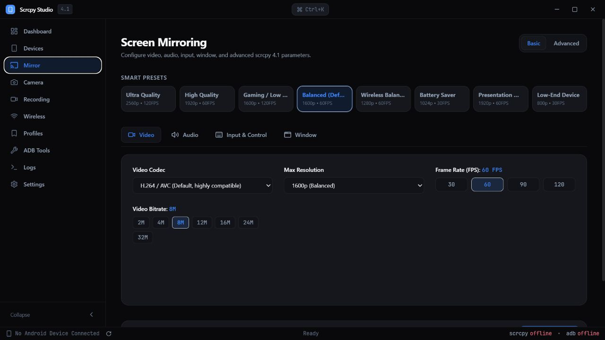

# Scrcpy Studio

[](https://github.com/lnb2x/scrcpy-studio/actions/workflows/ci.yml)
[](LICENSE)

Scrcpy Studio is a Windows desktop interface for managing Android devices and launching [scrcpy 4.1](https://github.com/Genymobile/scrcpy/releases/tag/v4.1) without assembling long command lines by hand. It is built with Tauri 2, Rust, React, TypeScript, and Tailwind CSS.

The app exposes a curated set of scrcpy options for common mirroring, camera, recording, OTG, and virtual-display workflows. Advanced users can append custom arguments when an option is not represented in the UI.

## Screenshots



_Dashboard and quick actions._



_Mirror presets, video settings, and live command configuration._

## Features

- Discover and inspect USB or wireless ADB devices.
- Launch multiple scrcpy sessions with presets for quality, latency, Wi-Fi, and battery use.
- Configure video, audio, input, window, and recording options with a live CLI preview.
- Mirror Android 12+ cameras and query available cameras or encoders.
- Pair and connect with Android Wireless Debugging without assuming the pairing port is the connection port.
- Install APKs, push files, capture screenshots, reboot devices, and browse third-party packages.
- Browse device storage: navigate folders, create directories, pull files to PC, and delete entries from a connected device.
- Launch or uninstall installed applications directly from the ADB Tools page.
- Save custom profiles, session history, application settings, and wireless connection history locally.
- View scrcpy process output and session status in real time.
- Navigate quickly with a command palette (Ctrl+K), keyboard shortcuts (`?`), and a toggleable sidebar (Ctrl+B).
- Use English or Vietnamese UI text where translations are currently available.

## Requirements

Scrcpy Studio is currently Windows-focused and tested for Windows 10/11.

- [Node.js](https://nodejs.org/) `>=20.19.0` or `>=22.12.0`
- [Rust](https://www.rust-lang.org/tools/install) with the stable MSVC toolchain
- Microsoft C++ Build Tools and Windows SDK for Tauri builds
- [scrcpy 4.1](https://github.com/Genymobile/scrcpy/releases/tag/v4.1)
- Android SDK Platform Tools (`adb`)
- WebView2 Runtime, normally included with current Windows releases

Scrcpy and ADB are detected from `PATH` and common Winget, Scoop, Android SDK, and local installation paths. Custom executable paths can also be selected in Settings.

On first launch, Runtime Diagnostics verifies that both executables can actually run, displays their detected versions, and reports whether an Android device is connected and authorized. Settings provides Auto Detect, Browse, Test, Check Runtime, and ADB Repair actions. Scrcpy Studio does not silently download or execute runtime archives.

Recommended Windows runtime sources:

- scrcpy 4.1 from the signed [Genymobile scrcpy release](https://github.com/Genymobile/scrcpy/releases/tag/v4.1) (Apache License 2.0).
- ADB from the official [Android SDK Platform Tools](https://developer.android.com/tools/releases/platform-tools) (Android SDK license).

The official scrcpy Windows archive also includes the matching ADB runtime. Review the upstream licenses before redistributing either runtime with a downstream package.

## Development

```powershell
git clone https://github.com/lnb2x/scrcpy-studio.git
cd scrcpy-studio
npm ci
npm run tauri dev
```

Useful checks:

```powershell
npm test
npm run lint
npm run build
cargo fmt --manifest-path src-tauri/Cargo.toml --all -- --check
cargo clippy --manifest-path src-tauri/Cargo.toml --all-targets --all-features -- -D warnings
npm run check:versions
```

Create a production installer with:

```powershell
npm run tauri build
```

The repository does not commit generated executables, `node_modules`, frontend bundles, or Rust target artifacts. Pushing a tag such as `v0.2.0` runs the Windows release workflow, verifies the full frontend/Rust suite, and publishes versioned NSIS and MSI installers. Releases remain unsigned when signing secrets are absent.

## Updates and signing

Automatic updates use Tauri 2's signed updater and the repository's HTTPS GitHub Release `latest.json`. Signature verification cannot be disabled. Unsigned builds display a clear message and continue to support manual updates.

Repository owners enable signed updater artifacts with these GitHub Actions secrets:

- `TAURI_SIGNING_PRIVATE_KEY`: Tauri updater private key content or path.
- `TAURI_SIGNING_PRIVATE_KEY_PASSWORD`: optional private-key password.
- `TAURI_UPDATER_PUBLIC_KEY`: matching public key embedded at compile time.

Optional Windows Authenticode signing is enabled independently when all of these secrets exist:

- `WINDOWS_CERTIFICATE`: the base64-encoded `.pfx` certificate.
- `WINDOWS_CERTIFICATE_PASSWORD`: the `.pfx` import password.
- `WINDOWS_TIMESTAMP_URL`: the certificate provider's timestamp service URL.

Generate the updater key pair with `npm run tauri signer generate`. Never commit the private key. The release runner imports an optional Windows certificate only for the build and removes it afterward; unsigned NSIS/MSI builds remain supported.

Versions in `package.json`, `package-lock.json`, `src-tauri/Cargo.toml`, and `src-tauri/tauri.conf.json` are checked by `npm run check:versions`. Tag builds also require the `vX.Y.Z` tag to match.

## Project structure

```text
src/                    React application, Zustand stores, command builder, and tests
src-tauri/src/          Rust commands, services, models, parsers, and process management
src-tauri/capabilities/ Tauri permission configuration
public/                 Static application assets
```

The TypeScript command builder drives the preview and is covered by unit tests. The Rust builder remains authoritative for launched processes; parity tests cover options with special compatibility rules, including camera selection and sizing.

## Scope and safety

- This is an independent, unofficial GUI. It is not affiliated with or endorsed by Genymobile.
- Scrcpy Studio does not bundle or modify scrcpy; it launches the executable installed on your computer.
- Android camera mirroring requires Android 12 or newer. Audio forwarding requires Android 11 or newer.
- Device capability badges are inferred from Android API level and should be treated as compatibility guidance, not hardware certification.
- ADB access is powerful. Review device prompts and custom arguments before running them.
- System tray minimize/restore remains on the roadmap; no partial tray behavior is enabled in this release.

## Author

Scrcpy Studio was created and is maintained by [@lnb2x](https://github.com/lnb2x).

## Credits

[scrcpy](https://github.com/Genymobile/scrcpy) is created and maintained by Romain Vimont and Genymobile contributors under the Apache License 2.0.

## License

Scrcpy Studio is available under the [MIT License](LICENSE).
